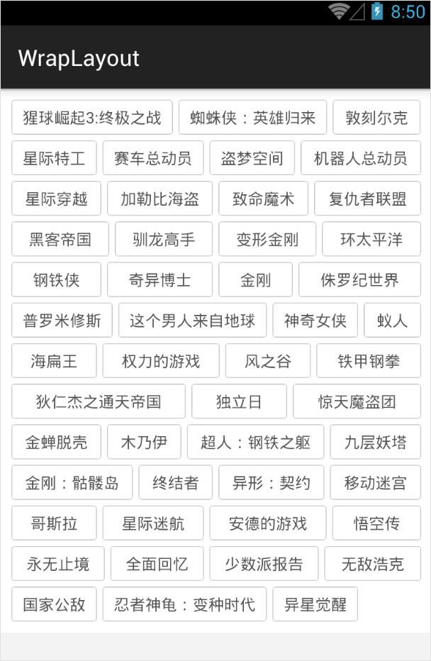

# AutoWrapLayout
a customized viewgroup wraps textviews and aligns on both left and right sides.

装载多个TextView并自动换行，网上有很多类似的自定义ViewGroup。<br>
此仓库并无二致，仅仅加上了左右两端对齐的功能。有兴趣的同学，欢迎review代码。
### 使用方法
1. xml布局文件
```xml
<com.stone.autowrap.lib.AutoWrapLayout
        android:id="@+id/wrap_layout"
        android:layout_width="match_parent"
        android:layout_height="wrap_content"
        android:background="#ffffff"
        android:padding="10dp"
        autoWrap:horizontalSpace="5dp"
        autoWrap:verticalSpace="5dp" />
```
2. java文件
```java
autoWrapLayout = (AutoWrapLayout) findViewById(R.id.wrap_layout);
autoWrapLayout.setAdapter(new AutoWrapLayout.WrapAdapter() {

            @Override
            public int getItemCount() {
                return dataList.size();
            }

            @Override
            public TextView onCreateTextView(int index) {
                TextView itemTv = (TextView) layoutInflater.inflate(R.layout.item_wrap_tv, null);
                itemTv.setText(dataList.get(index));
                itemTv.setTag(index);
                itemTv.setOnClickListener(itemClickListener);
                return itemTv;
            }
        });
```

### 截图

